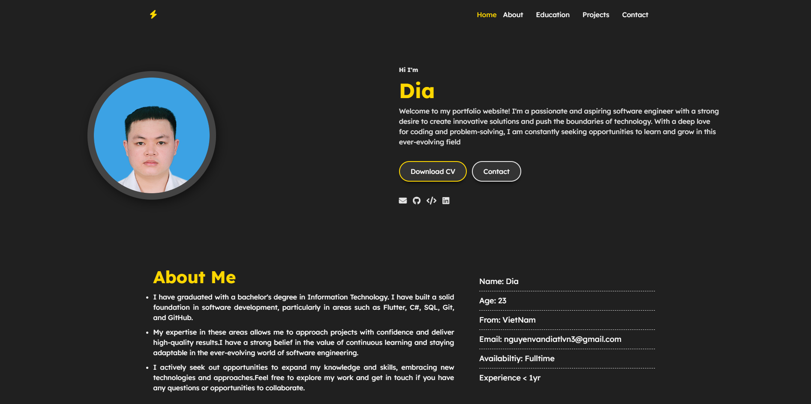

# Nguyen Van Dia — Personal Portfolio

A modern personal portfolio website built with vanilla HTML, CSS, and JavaScript. Features a dark theme with gold accents, smooth animations, and a fully responsive layout.



---

## Features

- **Typing animation** — role text cycles through titles using Typed.js
- **Glassmorphism cards** — frosted-glass style cards with subtle hover effects
- **Scroll animations** — elements reveal on scroll via ScrollReveal
- **Sticky header** — glassmorphism blur effect on scroll
- **Mobile menu** — animated hamburger with full-screen overlay
- **Floating labels** — modern contact form with animated labels
- **Contact form** — submissions sent to Google Sheets via Apps Script
- **Fully responsive** — works on mobile, tablet, and desktop

## Sections

| Section | Description |
|---|---|
| Home | Hero with avatar, typing animation, and social links |
| About | Bio and personal info card |
| Skills | Tech stack grouped by category |
| Experience | Timeline of work experience, education, and internships |
| Projects | Project cards with tech tags |
| Contact | Contact form + direct links |

## Tech Stack

- HTML5, CSS3 (custom properties, grid, flexbox)
- Vanilla JavaScript (ES6+)
- [Typed.js](https://github.com/mattboldt/typed.js/) — typing animation
- [ScrollReveal](https://scrollrevealjs.org/) — scroll animations
- [Font Awesome 6](https://fontawesome.com/) — icons
- [Google Fonts](https://fonts.google.com/) — Space Grotesk + Inter
- Google Apps Script — contact form backend

## Project Structure

```
portfolio-website/
├── index.html          # Main HTML structure
├── styles.css          # All styles (variables, layout, components, responsive)
├── script.js           # Interactivity (typed, scroll, nav, form)
└── files/
    ├── photo!!.png     # Profile photo
    ├── preview.png     # README preview image
    ├── Nguyen-Van-Dia.pdf  # CV / Resume
    └── ...
```

## Running Locally

No build step needed — open `index.html` directly in a browser, or serve with any static file server:

```bash
# Python
python -m http.server 8080

# Node
npx serve .
```

Then visit `http://localhost:8080`.

## Contact Form Setup

The form posts to a Google Apps Script endpoint. To use your own:

1. Create a Google Sheet
2. Go to **Extensions → Apps Script** and deploy a web app that writes form data to the sheet
3. Replace the `SCRIPT_URL` value in `script.js` with your deployment URL

## License

MIT — free to use and adapt for your own portfolio.
